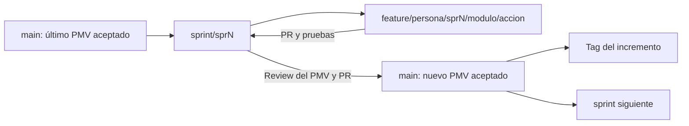

# Ramas, integración de sprints y releases

## Rama actual y transición

`feature/josef/spr2/map` es la rama actual y, por indicación del usuario, aloja esta coordinación del roadmap. Se conserva su nombre. No debe usarse como base automática para todas las funcionalidades ni como sustituto de una rama de integración.

La rama también contiene commits de UI/mapa/dashboard/reportes y administración. Antes de publicar el roadmap, revisar su diferencia contra el destino acordado: no asumir que un PR desde aquí contendrá solo documentación. Preparar un commit con los archivos documentales concretos y, si hace falta, llevarlo a una rama documental limpia basada en la integración mediante cherry-pick revisado. Esta tarea solo documenta el flujo; no crea ramas, commits, PR ni merges.

## Modelo propuesto

La retrospectiva ya exige `feature/<persona>/spr<N>/<módulo>/<acción>` y revisión por PR. Se extiende con ramas de integración por sprint para reemplazar la acumulación de ramas `merge/mg*`.

| Tipo | Patrón / ejemplo | Origen | Destino de PR | Función |
|---|---|---|---|---|
| Entrega | `main` | Release aceptado | — | Historial de incrementos aceptados y tags. |
| Sprint | `sprint/spr<N>`; `sprint/spr3` | Último PMV aceptado en main; bootstrap revisado si hace falta | `main` | Integrar y validar un solo sprint. |
| Funcionalidad | `feature/<persona>/spr<N>/<modulo>/<accion>` | Integración del sprint | `sprint/spr<N>` | Una US/EN o tarea coherente. |
| Corrección del sprint | `fix/<persona>/spr<N>/<modulo>/<accion>` | Integración del sprint | `sprint/spr<N>` | Bug identificado en integración/review. |
| Documentación futura | `docs/<persona>/spr<N>/<tema>/<accion>` | Integración del sprint | `sprint/spr<N>` | Cambio documental independiente; no renombra la rama actual. |
| Hotfix publicado | `hotfix/<persona>/<modulo>/<accion>` | Tag/commit publicado en main | `main`, y luego integración activa | Incidencia del incremento ya aceptado. |

Usar nombres en minúsculas, sin espacios ni tildes; conservar `feature/*` históricas. Las ramas `sprint/*` son propuestas y no existían en el inventario inspeccionado. El bootstrap debe escoger un commit integrado y revisado: no se presupone que `main`, el remoto local o un `merge/*` estén actualizados/aceptados.



## Ramas de trabajo sugeridas

| Sprint | Ejemplos propuestos, no creados |
|---|---|
| spr1 | `feature/carlos/spr1/infra/persistencia`, `feature/william/spr1/api/composicion`, `feature/alex/spr1/m_conductor/integracion` |
| spr2 | `feature/william/spr2/m_rutas/motor-inicial`, `feature/carlos/spr2/m_rutas/despacho`, `feature/alex/spr2/m_conductor/asignacion` |
| spr3 | `feature/josef/spr3/m_mapa/integracion-http`, `feature/william/spr3/dashboard/datos-operativos`, `feature/valentino/spr3/m_reportes/exportacion` |
| spr4 | `feature/william/spr4/m_rutas/reoptimizacion`, `feature/carlos/spr4/infra/recuperacion`, `feature/alex/spr4/calidad/aceptacion` |

Recuperar trabajo histórico por PR/commit revisado, sin recrearlo desde cero. Por ejemplo, la funcionalidad de una rama histórica `spr2` puede completar la recuperación de PMV-1; el sprint de aceptación se registra en la tarjeta y no exige renombrar la rama.

## Flujo de una tarea

1. Verificar `git status`, rama actual, destino y commit base; conservar cambios locales antes de cambiar de rama.
2. Crear la rama desde `sprint/sprN` acordada. Registrar US/EN/T y dueño con [plantilla de historia](templates/historia.md).
3. Acordar puertos/DTO/migraciones compartidos antes de modificar consumidores. Los cambios de `App.tsx`, composición API, entidad Order, tokens y lockfile requieren coordinación entre módulos.
4. Hacer commits pequeños y coherentes. Ejemplo: `feat(rutas): guardar asignación del día [US-005]`.
5. Ejecutar los checks relevantes, actualizar documentación/evidencia y abrir PR a `sprint/sprN` con [plantilla](templates/pull-request.md).
6. Un par técnico revisa código y arquitectura; otro integrante valida el flujo de staging. Resolver conflictos en la rama de trabajo y volver a probar lo afectado.
7. Integrar mediante merge de PR para conservar el rastro de ramas; al cerrar el sprint, PR de `sprint/sprN` a `main` con demo, matriz RF y resultados.

No integrar directamente por push a `main`; tampoco completar sprints mezclando ramas arbitrarias `merge/*`. Configurar protección de `main` y `sprint/*`, un review aprobado y checks obligatorios cuando la plataforma/pipeline estén preparados (T-08). Son controles propuestos, no configuraciones ya aplicadas.

## Comandos orientativos

Ejemplo **para trabajo futuro**, después de acordar la base y con árbol limpio. No ejecutar estos comandos para cambiar de rama mientras queden cambios locales sin conservar.

```powershell
git status --short
git fetch origin
git switch sprint/spr3
git pull --ff-only origin sprint/spr3
git switch -c feature/josef/spr3/m_mapa/integracion-http
```

Creación de integración por el coordinador, una vez que `main` contiene el PMV previo aceptado:

```powershell
git switch main
git pull --ff-only origin main
git switch -c sprint/spr3
git push -u origin sprint/spr3
```

Los comandos presuponen que el remoto y la rama base están verificados. No incluyen una integración automática del historial actual ni autorización para publicar esta sesión.

## Tags, arrastre y recuperación

Tags propuestos: `v0.1.0-pmv1`, `v0.2.0-pmv2`, `v0.3.0-pmv3` y `v1.0.0-MVP` para el final, conservando el nombre de release histórico. Comprobar que no existen antes de crearlos. Cada tag apunta al commit aceptado en `main`, con acta/evidencia y cambios/limitaciones descritos; no se mueve un tag publicado.

Una historia incompleta permanece abierta. Si continúa en otro sprint, crear rama de continuación desde la nueva integración y trasladar únicamente commits revisados; enlazar origen y destino. Evitar fusionar todo un sprint anterior para rescatar una tarea.

Una corrección de release también se incorpora al sprint activo mediante PR para evitar perderla. Ante un merge defectuoso, preparar un revert revisado que conserve historial y verificar compatibilidad con BD; el rollback de datos sigue su procedimiento de migraciones/backup. No usar reset forzado ni reescribir ramas compartidas. Eliminar ramas de trabajo solo tras aceptación y verificación de que el trabajo útil está integrado.
