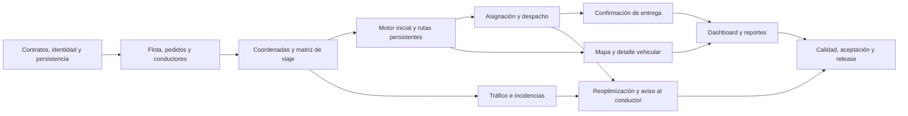

# Hoja de ruta de todo el desarrollo

Estado: propuesta de ejecución al **08/10/2026**. Consultar [estado actual](estado-actual.md) antes de marcar un hito como terminado.

## Resultado buscado

Demostrar el flujo completo: administrador registra recursos; operador registra pedidos geolocalizados y genera rutas factibles; conductor consulta su asignación y confirma entregas; operador supervisa mapa; logística consulta indicadores y exporta resultados; una incidencia permite reoptimizar conservando el avance.

Cada incremento debe poder ejecutarse con el mismo backend, identidad y almacenamiento compartido. Los datasets sintéticos permiten validación académica si su origen queda explícito; los resultados deben calcularse con el motor y los datos del flujo, con evidencia reproducible.

## Iteraciones, sprints y PMV

Se conservan las cuatro iteraciones del Acta y los nombres `spr1`–`spr4` existentes. Iteración y sprint tienen funciones diferentes: la primera agrupa hitos; el segundo entrega un incremento. Esta distribución de sprints es propuesta, no reconstrucción del calendario histórico.

| Iteración / semanas relativas | Sprint propuesto / duración | Incremento | Resultado verificable |
|---|---|---|---|
| I1: 1–3 | Preparación, sin renumerar ramas | Base de desarrollo | Requisitos conciliados, diseño, contratos, BD y entorno acordados. No es un PMV funcional. |
| I2: 4–5 | `spr1` / 2 semanas | PMV-1: gestión base | Flota, pedidos y conductores persistentes; identidad y permisos básicos; una API compartida. |
| I2: 6–7 | `spr2` / 2 semanas | PMV-2: planificación y ejecución | Motor inicial, rutas guardadas, asignación/despacho y confirmación del conductor sobre los mismos pedidos. |
| I3: 8–11 | `spr3` / 4 semanas | PMV-3: supervisión sostenible | Mapa conectado, dashboard y reportes calculados, CSV y entrada de tráfico trazable. |
| I4: 12–14 | `spr4` / 3 semanas | PMV-4: entrega final | Optimización avanzada, reoptimización, calidad, infraestructura, manuales y aceptación. |

`spr3` tiene una revisión intermedia en la semana 9. Si el equipo adopta sprints uniformes de dos semanas, debe registrar una replanificación de IDs y ramas en [decisiones.md](decisiones.md) antes de abrir ramas nuevas. No se renombrarán ramas históricas para hacerlas coincidir con este cuadro.

## Condiciones de cada incremento

### PMV-1: gestión base

- Alcance: EN-00, US-001, US-002, US-003, US-012 y US-013. Iniciar EN-02 y EN-05 como trabajo transversal.
- Entrega: migraciones reproducibles PostgreSQL/PostGIS; CRUD integrado; unicidad de placa/DNI/licencia; ventanas y peso válidos; cancelación lógica; errores y permisos comprobados.
- Demo: crear vehículo, conductor y pedido; reiniciar backend y verificar persistencia; rechazar duplicados y operaciones de un rol sin permiso.
- Salida: [DoD](calidad.md) cumplida para el alcance aceptado. Registrar como pendiente cualquier restricción de conductor con ruta activa hasta que exista la asignación del PMV-2.

### PMV-2: planificación y ejecución

- Alcance: US-005, US-004 y primera versión de EN-01; coordenadas, matriz de viaje, asignación y despacho son tareas necesarias del incremento.
- Entrega: una solución calculada con capacidad y ventanas; pedidos no asignables explicados; vehículo/conductor disponibles; aprobación guarda rutas y secuencia; despacho habilita `PENDIENTE → EN_CAMINO`; entrega conserva su primera hora.
- Demo: registrar pedidos, generar, aprobar, despachar, consultar la ruta con la identidad del conductor y confirmar un pedido. Verificar conservación después de reiniciar.
- Medición: establecer benchmark hasta 150/15 desde este sprint. El cumplimiento de ≤45 s P95 se acredita con mediciones; si falla, EN-01 permanece abierto aunque haya un motor inicial.

### PMV-3: supervisión sostenible

- Alcance: US-006–US-011; completar EN-02; integración de tráfico y avance de EN-05.
- Entrega: mapa con rutas y estados del backend; detalle vehicular con ETA; vista en lista ante fallo cartográfico; dashboard por día/distrito; emisiones, combustible y línea base trazables; reporte por rango y CSV.
- Demo: confirmar entrega y observar el mismo cambio en mapa/dashboard; filtrar un distrito sin datos; exportar y conciliar totales; simular caída de cartografía y mostrar lista.
- Salida: medir reporte ≤1.5 s P95. Distinguir posición observada, estimación y dato sintético con marca temporal; una posición inferida de una parada no acredita ubicación GPS en tiempo real.

### PMV-4: entrega final

- Alcance: cerrar EN-01, EN-04, EN-03, EN-05 y EN-06; estabilizar todas las historias y documentación.
- Entrega: optimización con variables ambientales y zonas parametrizadas; incidencia/reoptimización sin duplicar asignaciones ni deshacer entregas; conductor recibe nueva versión de ruta; staging reproducible, recuperación y manuales.
- Demo: ejecutar flujo integral, reportar bloqueo, reoptimizar y verificar paradas completadas; probar caso sin alternativa; reproducir métricas y rollback.
- Salida: gates de calidad y aceptación de [calidad.md](calidad.md). Una excepción de alcance aprobada se documenta; no equivale a demostrar el RNF exceptuado.

## Dependencias que gobiernan el orden

Se puede desarrollar UI y adaptadores con contratos acordados en paralelo entre integrantes. Cada PMV se cierra con integración del flujo y pruebas de sus dependencias. Las reglas RN-001–RN-009 y la arquitectura hexagonal acompañan todos los incrementos.

## Cobertura mínima y alcance final

La meta documental es al menos el 70 % de RF-001–RF-007. Para seguimiento se propone contar requisitos completos: **5/7 = 71.43 %**. Una pantalla, un puerto o una historia parcial no cuentan como un RF completo. El equipo debe confirmar este método en D-02; si acuerda otra ponderación, debe publicar pesos y criterios antes de medir.

| RF | Incremento previsto de cierre funcional | Condición principal |
|---|---|---|
| RF-001 Flota | PMV-1 | Registrar, editar y consultar con persistencia y permisos. |
| RF-002 Pedidos | PMV-2 | Registrar, consultar, actualizar y confirmar en un flujo con asignación real. |
| RF-003 Rutas | PMV-4, con avance PMV-2 | Motor válido, restricciones operativas/ambientales y tráfico; rendimiento acreditado. |
| RF-004 Mapa | PMV-3 | Rutas, pedidos, posición actualizada, detalle/ETA y contingencia en lista. |
| RF-005 Dashboard | PMV-3 | Métricas de la operación y filtro por distrito; cero cuando no hay datos. |
| RF-006 Reportes | PMV-3 | Rango de fechas, métricas reales del flujo, CSV y umbral P95. |
| RF-007 Conductores | PMV-2, con avance PMV-1 | Gestión de perfil y vínculo válido; desactivación protege rutas activas e historial. |

La planificación apunta a **7/7**. Alcanzar 5/7 no elimina las obligaciones explícitas del Acta sobre optimización, reoptimización, seguridad, calidad y documentación. El release histórico que enumera EP-01, EP-02, EP-03 parcial y EP-07 no acredita por sí solo el 70 %.

## Priorización y control del alcance

1. Recuperar el código existente y completar identidad, persistencia y composición común.
2. Cerrar el flujo pedido → planificación → despacho → entrega.
3. Conectar mapa, indicadores y reportes al mismo estado operacional.
4. Incorporar tráfico, reoptimización, zonas y mediciones de calidad.
5. Estabilizar, documentar y aceptar el release.

RF-008/RF-009 tentativos, facturación, fotos, firmas y nuevas integraciones permanecen fuera del compromiso actual. El aviso al conductor requerido por EN-04 sí pertenece al alcance; su canal se decide sin presuponer notificaciones push.

La capacidad se decide por sprint usando disponibilidad real y trabajo restante; los puntos originales no son horas ni estimaciones automáticas de tareas. El presupuesto académico modela 700 horas en 14 semanas; no debe confundirse con la inversión referencial del cliente. Cada review registra consumo, costos de APIs/hosting y cambios de alcance.

El siguiente paso es el bloque de coordinación en [task.md](task.md), seguido de la recuperación de PMV-1 y PMV-2. Tener ramas con `spr2` o UI con `spr3` no prueba que esos sprints estén aceptados.
