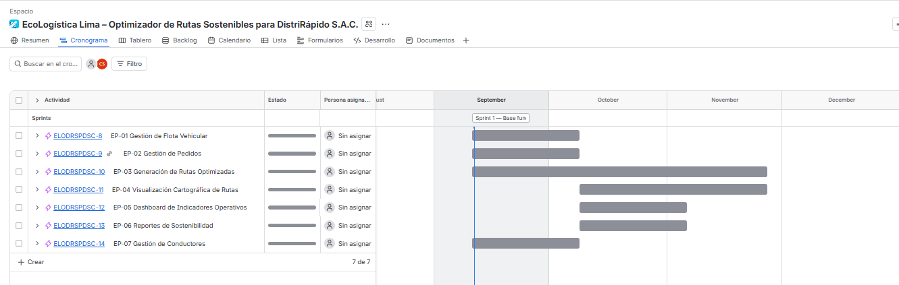
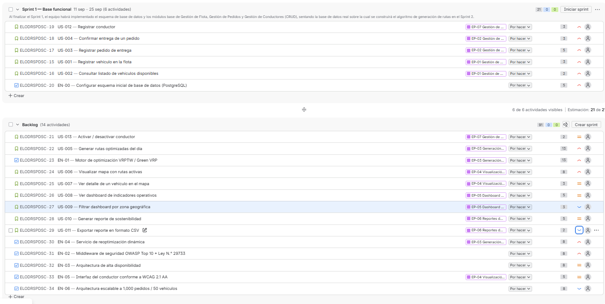
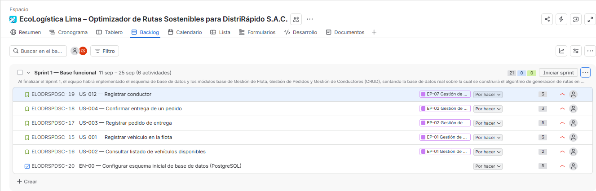
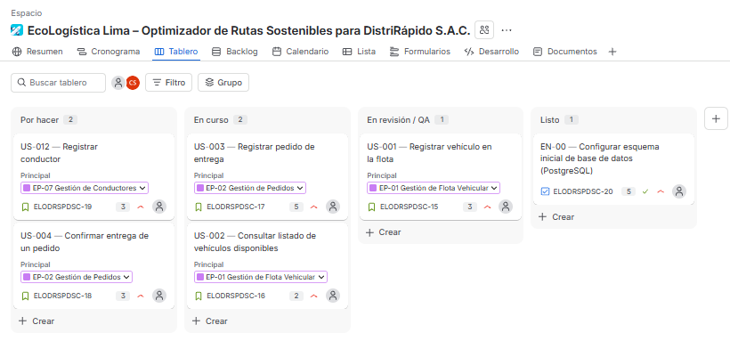
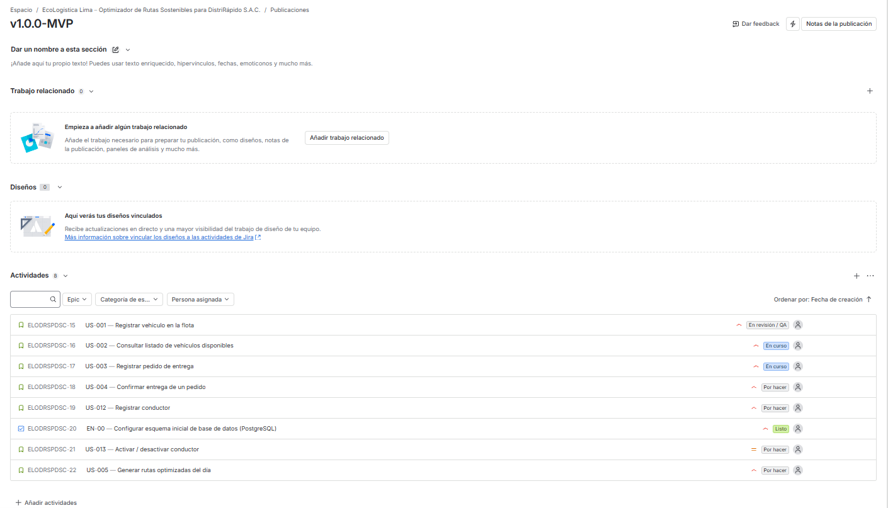

[← Volver al README Principal](../../README.md)

# 02. Artefactos Jira

## 1. Datos generales

| Campo | Información |
|---|---|
| **Proyecto** | EcoLogística Lima – Optimizador de Rutas Sostenibles para DistriRápido S.A.C. |
| **Fase** | 02. Planificación |
| **Versión** | V_1_0_0 |
| **Fecha** | 11/09/2026 |

## 2. Configuración base del proyecto en Jira

Pasos sugeridos para configurar el proyecto (tipo **Scrum**, plantilla "Software de equipo"):

1. Crear el proyecto Jira con clave corta, por ejemplo `ECOL`.
2. Habilitar la jerarquía: Épica → Historia/Enabler (Story) → Subtarea, y activar el tipo **Bug** para incidencias detectadas en Sprint.
3. Crear las 7 Épicas de la sección 3 de `01 Transformando a ágil V_1_0_0.md` (EP-01 a EP-07).
4. Cargar cada ítem del backlog (sección 4 del mismo documento) como Story o Enabler, vinculado a su Épica, con su estimación en Story Points.
5. Configurar el tablero Scrum con columnas: **To Do → In Progress → In Review / QA → Done**.
6. Crear la versión/release `v1.0.0-MVP`.

---

## 3. Evidencia 1 — Roadmap del proyecto

Alineación de las Épicas en la línea de tiempo, conforme al cronograma de iteraciones ya definido en `01. Selección del enfoque del proyecto V_1_0_0.md`:

| Iteración | Semanas | Épicas / Enablers planificados |
|---|---|---|
| Iteración 1 (cerrada) | 1-3 | Requisitos, investigación, BD (documentación de la Fase 01. Inicio) |
| Iteración 2 | 4-7 | EN-00, EP-01, EP-02, EP-07 y versión inicial de EP-03 |
| Iteración 3 | 8-11 | EP-04, EP-05, EP-06, EN-02, integración de datos de tráfico |
| Iteración 4 | 12-14 | EN-01 (algoritmo avanzado), EN-04, EN-03, EN-05, EN-06, pruebas y documentación final |

---

## 4. Evidencia 2 — Backlog priorizado

El backlog completo, ya priorizado y estimado en Story Points, está en la sección 4 de `01 Transformando a ágil V_1_0_0.md`. Al cargarlo en Jira, el Backlog debe reflejar ese mismo orden y esas mismas estimaciones, agrupado por componente/Épica.

---

## 5. Evidencia 3 — Sprint Planning y Sprint Goal

### Sprint 1 propuesto (2 semanas, corresponde al inicio de la Iteración 2)

**Sprint Goal:**

> "Al finalizar el Sprint 1, el equipo habrá implementado el esquema de base de datos y los módulos base de Gestión de Flota, Gestión de Pedidos y Gestión de Conductores (CRUD), sentando la base de datos real sobre la cual se construirá el algoritmo de generación de rutas en el Sprint 2."

**Ítems seleccionados para el Sprint 1:**

| ID | Título | Story Points |
|---|---|---:|
| EN-00 | Configurar esquema inicial de base de datos | 5 |
| US-001 | Registrar vehículo en la flota | 3 |
| US-002 | Consultar listado de vehículos disponibles | 2 |
| US-003 | Registrar pedido de entrega | 5 |
| US-004 | Confirmar entrega de un pedido | 3 |
| US-012 | Registrar conductor | 3 |
| **Total** | | **21** |

---

## 6. Evidencia 4 — Tablero Scrum activo

---

## 7. Evidencia 5 — Gestión de versiones / Release

Versión creada en Jira: **v1.0.0-MVP**, asociada a las Épicas EP-01, EP-02, EP-03 (parcial) y EP-07, correspondientes al alcance mínimo del PMV definido en el Acta de Constitución.

---

## 8. Control de versiones del documento

| Versión | Fecha | Autor | Descripción del cambio |
|---|---|---|---|
| V_1_0_0 | 11/09/2026 | Equipo del proyecto | Configuración de artefactos Jira con Roadmap, backlog priorizado, Sprint Planning, tablero Scrum y Release v1.0.0-MVP, incluyendo evidencias reales. |

[← Volver al README Principal](../../README.md)